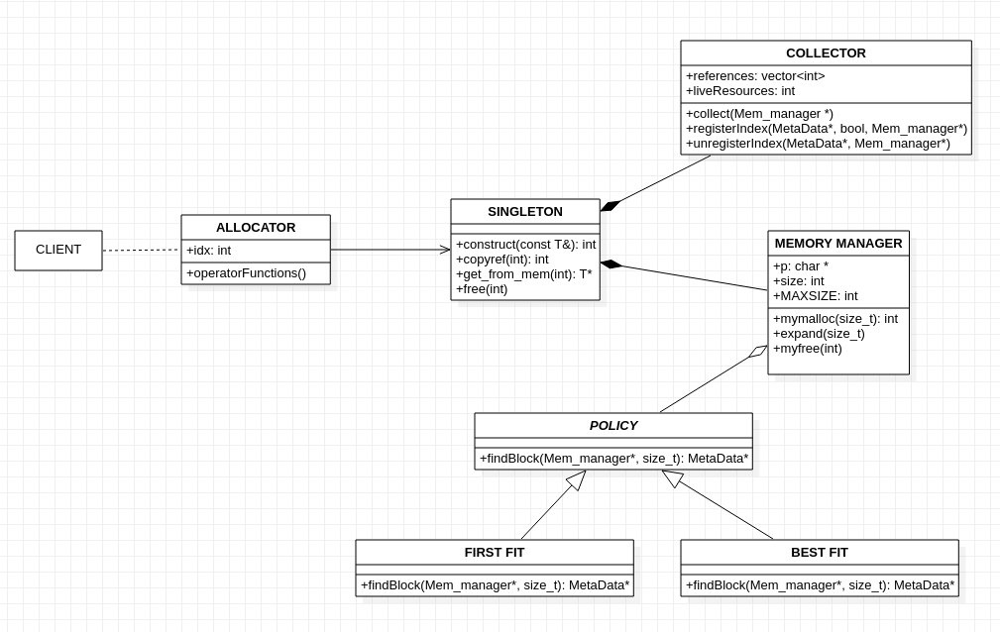

# Garbage-Collection-in-Cpp

Team members:
1. Abhijit Mohanty - PES1201801293 - Section C
2. Dhruva Kashyap - PES1201801457 - Section F
3. Thrivikraman V  - PES1201801469 - Section D

## Abstract

In this project, we implement a garbage collector in C++. C++ is not a fully managed language like Java. It is very well known that Java’s garbage collector is the greatest feature of Java, but, it would seem the entire language is built upon this invalid premise that the language must assume that the programmer does not know how to handle resources. 
C++ is a more mature language, giving the programmer absolute authority and responsibility over all resources they request. In C++, we implement the mark and sweep algorithm, over references that the client requests and releases. The client interacts through an allocator, called GCBase, where they specify the type of the object, which could be a primitive type, or a class.
This GCBase class supports all the operators of the type and the user can use the object as they would use an object of the actual type. 
The allocator internally contains a “pointer” to the actual location of the memory in the heap. The pointer is actually an index in the memory buffer.
The allocator modifies the memory through a singleton, memSingleton. This memSingleton acts like a facade, and allows for getting from memory, creating a new object, or destroying it.
The singleton is composed of a collector and a memory manager. The collector performs the mark and sweep algorithm. When the client releases the resource, the singleton requests the collector to unregister the resource. On copies, the singleton requests the collector to register multiple references to the same object. On failure to allocation, the singleton requests the collector to perform garbage collection.
The memory manager is buffer based memory manager with internal bookkeeping. It can allocate bytes of memory  as requested and release it from memory calculation when requested.

## Architecture

<p align="center">

</p>

## Code structure

```
├── client.cpp
├── include
│   ├── collector
│   │   └── collector.h
│   ├── gc.h
│   ├── memsingleton
│   │   └── memsingleton.h
│   ├── meta
│   │   └── meta.h
│   ├── mm
│   │   └── mm.h
│   └── policy
│       ├── best_fit.h
│       ├── first_fit.h
│       └── policy.h
└── src
    ├── collector
    │   ├── collector.cpp
    ├── memsingleton
    │   ├── memsingleton.cpp
    ├── meta
    │   └── meta.cpp
    ├── mm
    │   ├── mm.cpp
    └── policy
        ├── best_fit.cpp
        ├── first_fit.cpp
        ├── policy.cpp
```

## Running the application

```shell
$ make
$ ./a.out
```
